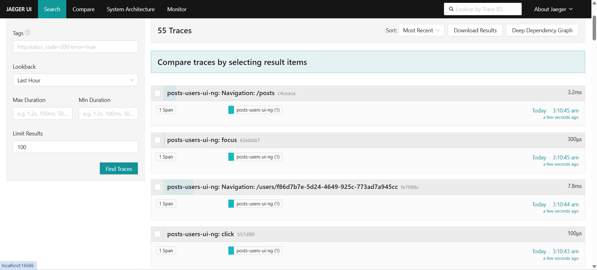
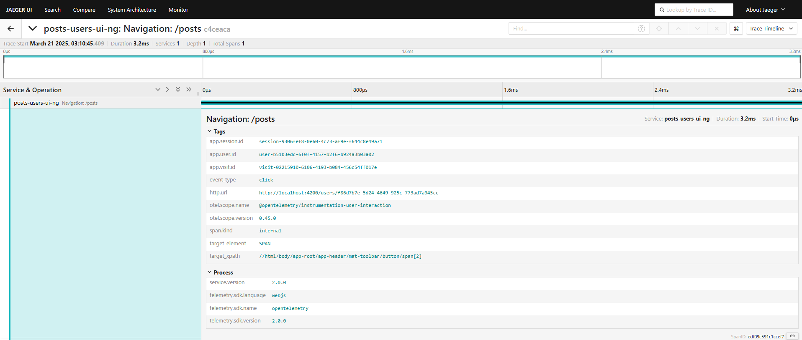

# Replication Package – Angular Frontend & Node.js Backend  
This folder contains the replication artifacts for the **Angular/Node.js** configuration used in our study *Telemetry of Web Applications: An Industrial Case Study*. For common instructions (global tools, telemetry backend, instrumentation agent integration, etc.), please refer to the [global README](../README.md) in the repository root.

---

## 📂 Package Contents  
- `posts-users-ui-ng/` – Angular frontend application  
- `posts-users-backend-nodejs/` – Node.js backend application  
- `screenshots/` – Jaeger trace screenshots for the Angular app

```
replication-angular-node/
├── posts-users-ui-ng/         # Angular frontend (submodule)
├── posts-users-backend-nodejs/  # Node.js backend (submodule)
└── screenshots/               # Jaeger trace screenshots
```

---

## 🔧 Prerequisites  
Please ensure you have the following tools installed (see [global README](../README.md#️-common-tools) for details):
- **Java JDK 11+ ☕**
- **Apache Maven 3.x 🛠️**
- **Node.js & npm 🟢**
- **Docker Compose 🐳**

---

## 🚀 Replication Steps
### 1. Launch the Telemetry Backend  
Before running the applications, launch the telemetry backend (see [global README](../README.md#-global-replication-steps) for details):
1. Open a terminal and navigate to:
   ```sh
   cd telemetry/telemetry-backend
   ```
2. Launch with Docker Compose:
   ```sh
   docker-compose up -d
   ```
3. Confirm that Jaeger is accessible at [http://localhost:16686](http://localhost:16686).

---

### 2. Instrumentation Integration  
Our prebuilt instrumentation agents are provided in the global repository. For details, see the [global README](../README.md#2-use-the-prebuilt-instrumentation-agents).
- **Frontend Agent:**  
  Located in `telemetry/instrumentation-frontend-user-experience/prebuilt`  
  *(Integrate by including the appropriate `<script>` tag in your Angular app’s HTML.)*

---

### 3. Run the Applications
#### 🖥️ Node.js Backend
1. Open a terminal and navigate to the backend folder:
   ```sh
   cd replication-angular-node/posts-users-backend-nodejs
   ```
2. Install dependencies and run the backend:
   ```sh
   npm install
   npm run dev
   ```
3. The backend service should be running on its configured port (e.g., [http://localhost:5000](http://localhost:5000)).

#### 🌐 Angular Frontend
1. Open another terminal and navigate to the Angular application folder:
   ```sh
   cd replication-angular-node/posts-users-ui-ng
   ```
2. Install dependencies and start the application:
   ```sh
   npm install
   npm start
   ```
3. Access the app at: [http://localhost:4200](http://localhost:4200)

---

### 4. Interact & Verify
- **User Interactions:**  
  Interact with the Angular app (e.g., clicks, form submissions) to generate telemetry data.
- **Trace Verification:**  
  Open Jaeger UI ([http://localhost:16686](http://localhost:16686)) to view and analyze the collected traces.

*For package-specific configuration details or further instructions, please refer to the individual README files within the corresponding submodules.*

---

## 🔍 Screenshots  
### Traces Overview  
This screenshot shows the Jaeger search page (trace timeline and comparator) for the last 100 frontend traces collected in the past hour.


### Trace Detail  
Since each user interaction produces a single span, this screenshot displays the detailed span view — including all tags (service name, user/session IDs, timestamps) and process metadata.
