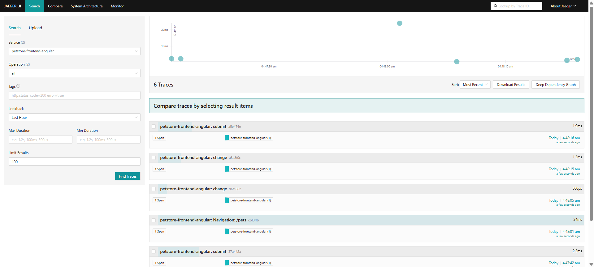
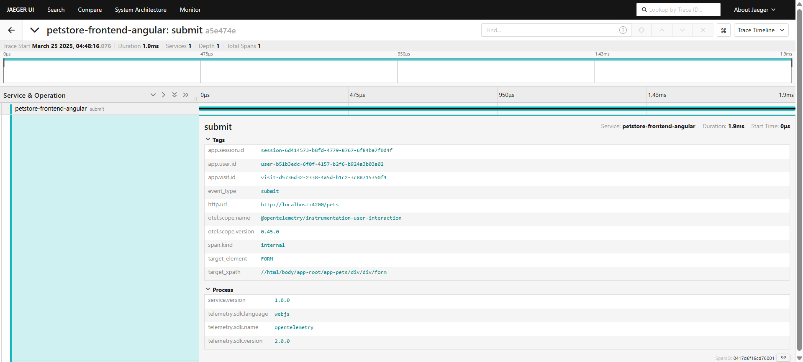
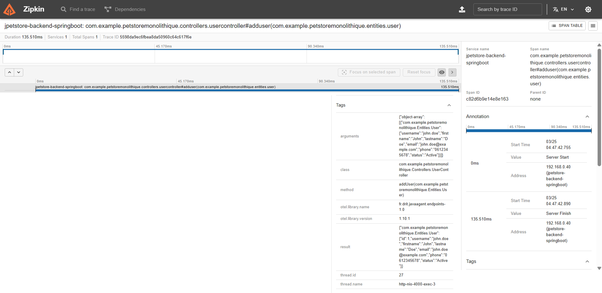

# Replication Package – Angular Frontend & Spring Boot Backend  
This folder contains the replication artifacts for the **Angular/Spring Boot** configuration used in our study *Telemetry of Web Applications: An Industrial Case Study*. For common instructions (global tools, telemetry backend, instrumentation agent integration, etc.), please refer to the [global README](../README.md) in the repository root.

---

## 📂 Package Contents  
- `jpetstore-backend-spring-boot/` – Spring Boot backend application (PetStore API)  
- `petstore-frontend-angular/` – Angular frontend application  
- `screenshots/` – Jaeger and Zipkin trace screenshots for the PetStore application  

```plaintext
replication-angular-spring-boot/
├── jpetstore-backend-spring-boot/   # Spring Boot backend (submodule)
├── petstore-frontend-angular/       # Angular frontend (submodule)
└── screenshots/                     # Screenshots of traces (frontend & backend)
```

---

## 🔧 Prerequisites  
Ensure you have the following tools installed (see [global README](../README.md#️-common-tools) for details):
- **Java JDK 11+ ☕**
- **Apache Maven 3.x 🛠️**
- **Node.js & npm 🟢**
- **Docker Compose 🐳**

---

## 🚀 Replication Steps
### 1. Launch the Telemetry Backend  
Before running the applications, launch the telemetry backend (see [global README](../README.md#-global-replication-steps) for details):

1. Open a terminal and navigate to:
   ```sh
   cd telemetry/telemetry-backend
   ```
2. Launch the services using Docker Compose:
   ```sh
   docker-compose up -d
   ```
3. Verify that Jaeger is accessible at [http://localhost:16686](http://localhost:16686) for the frontend traces.
4. Launch a Zipkin container using Docker:
   ```sh
   docker run -d -p 9411:9411 openzipkin/zipkin
   ```
5. Verify that Zipkin is accessible at [http://localhost:9411](http://localhost:9411) for the backend traces.

---

### 2. Instrumentation Integration  
Our prebuilt instrumentation agents are available in the global repository. For details, see the [global README](../README.md#2-use-the-prebuilt-instrumentation-agents).
- **Frontend Agent:**  
  Located in `telemetry/instrumentation-frontend-user-experience/prebuilt`  
  *(Integrate by adding the appropriate `<script>` tag to your Angular app’s HTML.)*
- **Backend Agent:**  
  Located in `telemetry/instrumentation-backend-test-automation/prebuilt`  
  *(Attach as a Java agent when launching your backend application.)*

---

### 3. Run the Applications
#### 🖥️ Spring Boot Backend  
1. **Database Setup:**  
   - Spin up a PostgreSQL container:
     ```sh
     docker run --name postgres-container -e POSTGRES_PASSWORD=password -p 5432:5432 -d postgres:latest
     ```
   - Create the `petstore` database:
     ```sh
     docker exec -it postgres-container psql -U postgres -c "CREATE DATABASE petstore;"
     ```
2. **Build the Backend:**  
   In the `jpetstore-backend-spring-boot` folder, build the application:
   ```sh
   cd replication-angular-spring-boot/jpetstore-backend-spring-boot
   mvn clean package
   ```
3. **Run the Backend:**  
   Launch the Spring Boot application (*adjust the command if using the instrumentation agent*):
   ```sh
   java -jar target/PetStore-Monolithique-0.0.1-SNAPSHOT.jar
   ```

4. The backend service should be running on its configured port (e.g., [http://localhost:4000](http://localhost:4000)).

#### 🌐 Angular Frontend  
1. Open a terminal and navigate to the Angular application folder:
   ```sh
   cd replication-angular-spring-boot/petstore-frontend-angular
   ```
2. Install dependencies and start the application:
   ```sh
   npm install
   npm run dev
   ```
3. Access the app at: [http://localhost:4200](http://localhost:4200)

---

### 4. Interact & Verify  
- **User Interactions:** Interact with the Angular app (e.g., form submissions, clicks) to generate telemetry data.
- **Trace Verification:**
   1. Open Jaeger UI ([http://localhost:16686](http://localhost:16686)) to view and analyze the collected frontend traces.
   2. Open Zipkin UI ([http://localhost:9411](http://localhost:9411)) to view and analyze the collected backend traces.

*For package-specific configuration details or further instructions, please refer to the README files within each submodule.*

---

## 🔍 Screenshots  
### 🌐 Frontend
#### Traces Overview  
This screenshot shows the Jaeger search page (trace timeline and comparator) for the last 100 frontend traces collected in the past hour.  


#### Trace Detail  
This screenshot displays the detailed span view—including all tags (e.g., service name, user/session IDs, timestamps) and process metadata.  


---

### 🖥️ Backend
#### Traces Overview  
This screenshot shows the Zipkin search page (trace timeline and comparator) for the last 100 backend traces collected in the past hour.  


#### Trace Detail  
This screenshot displays the detailed span view—including all data for test automation (e.g., REST API classes, methods, arguments, results) and process metadata.  
