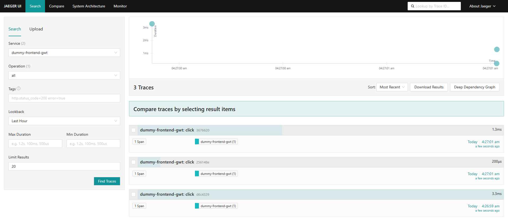
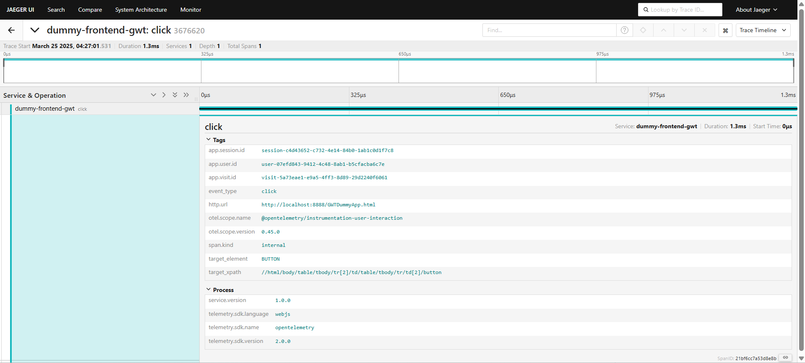

# Replication Package – GWT Frontend  
This folder contains the replication artifacts for the **GWT** configuration used in our study *Telemetry of Web Applications: An Industrial Case Study*. For common instructions (global tools, telemetry backend, instrumentation agent integration, etc.), please refer to the [global README](../README.md) in the repository root.

---

## 📂 Package Contents  
- `dummy-frontend-gwt/` – GWT dummy frontend application  
- `screenshots/` – Jaeger trace screenshots for the GWT app  

```plaintext
replication-gwt/
├── dummy-frontend-gwt/    # GWT frontend application (submodule)
└── screenshots/           # Jaeger trace screenshots
```

---

## 🛠️ Environment Setup
### 🔧 Prerequisites  
Please ensure you have the following tools installed (see [global README](../README.md#️-common-tools) for details):
- **Java JDK 1.8+ ☕**
- **Apache Maven 3.x 🛠️**
- **GWT SDK 2.12.2**  
  *Tip: Set the `GWT_HOME` environment variable to the SDK installation directory and add it to your `PATH` for CLI access.*
- **Docker Compose 🐳** *(for launching the telemetry backend)*

---

### GWT Frontend  
1. Open a terminal and navigate to the GWT application folder:
   ```sh
   cd replication-gwt/dummy-frontend-gwt
   ```
2. Build the project using Maven:
   ```sh
   mvn clean package
   ```
3. Launch the application in development mode:
   ```sh
   mvn gwt:run
   ```
4. Once the embedded Jetty server starts, open your browser and navigate to:
   ```
   http://localhost:8888/GWTDummyApp.html
   ```
   You should see the GWT application running.

---

## 🚀 Replication Steps
### 1. Launch the Telemetry Backend  
Before running the application, start the telemetry backend (refer to the [global README](../README.md#-global-replication-steps) for details):

1. Open a terminal and navigate to:
   ```sh
   cd telemetry/telemetry-backend
   ```
2. Launch the services using Docker Compose:
   ```sh
   docker-compose up -d
   ```
3. Verify that Jaeger is accessible at [http://localhost:16686](http://localhost:16686).

---

### 2. Instrumentation Integration  
Our prebuilt instrumentation agents are provided in the global repository. For details, see the [global README](../README.md#2-use-the-prebuilt-instrumentation-agents).

#### Frontend Agent 
1. Locate under `telemetry/instrumentation-frontend-user-experience/prebuilt` in our repository root.
2. Copy it under `src/main/webapp/assets/telemetry/` of the GWT application.
3. Link it to the application's `index.html` page by adding the following script tag at the end of the page's body :

```html
<body>
   <!-- Existing application content-->
   ... 
   <!-- Link to agent-->
   <script src="assets/telemetry/dummy-frontend-gwt-2025-03-24T23-19-01-815Z.js"></script>
</body>
```

4. *Note: if the frontend application doesn't use a live reload server to recompile automatically upon change detection, then it must be rebuilt and redeployed again after instrumentation*.

---

### 3. Interact & Verify  
- **User Interactions:** Interact with the application (e.g., fill in the text field and click the button) to generate telemetry data.
- **Trace Verification:** Open Jaeger UI ([http://localhost:16686](http://localhost:16686)) to view and analyze the collected frontend traces.

*For submodule-specific configuration details or further instructions, please refer to the README file within the submodule.*

---

## 🔍 Screenshots  
### Traces Overview  
This screenshot shows the Jaeger search page (trace timeline and comparator) for the last 100 frontend traces collected in the past hour.  


### Trace Detail  
This screenshot displays the detailed span view—including all tags (e.g., service name, user/session IDs, timestamps) and process metadata.  
