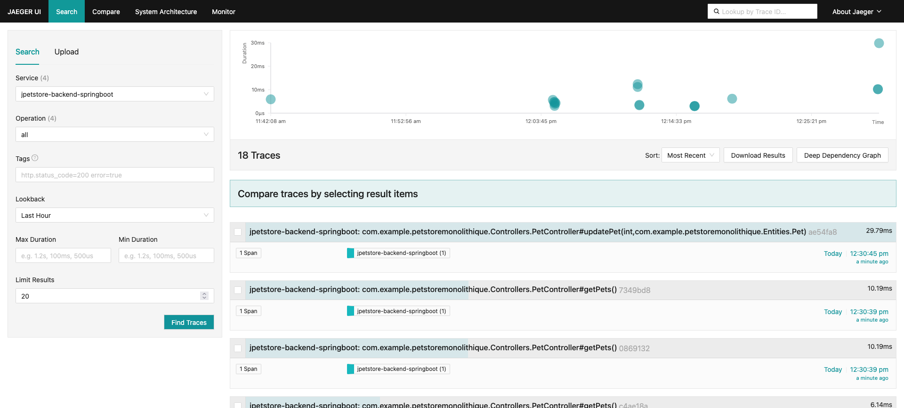

# Replication Package – React Frontend & Spring Boot Backend  
This folder contains the replication artifacts for the **React/Spring Boot** configuration used in our study *Telemetry of Web Applications: An Industrial Case Study*. For common instructions (global tools, telemetry backend, instrumentation agent integration, etc.), please refer to the [global README](../README.md) in the repository root.

---

## 📂 Package Contents  
- `jpetstore-backend-spring-boot/` – Spring Boot backend application (PetStore API)  
- `petstore-frontend-react/` – React frontend application (built with React and Vite)  
- `screenshots/` – Jaeger trace screenshots for the PetStore application  

```plaintext
replication-react-spring-boot/
├── jpetstore-backend-spring-boot/   # Spring Boot backend (submodule)
├── petstore-frontend-react/         # React frontend (submodule)
└── screenshots/                     # Screenshots of traces (frontend & backend)
```

---

## 🛠️ Environment Setup
### 🔧 Prerequisites  
Ensure you have the following tools installed (see [global README](../README.md#️-common-tools) for details):
- **Java JDK 11+ ☕**
- **Apache Maven 3.x 🛠️**
- **Node.js & npm 🟢**
- **Docker Compose 🐳**

---

### 🖥️ Spring Boot Backend  
1. **Database Setup:** In the `jpetstore-backend-spring-boot` folder, use Docker to setup the database:
     ```sh
     cd replication-angular-spring-boot/jpetstore-backend-spring-boot
     docker compose up -d
     ```
1. **Build the Backend:**  
   ```sh
   mvn clean package
   ```
2. **Run the Backend:**  
   Launch the Spring Boot application on the generated jar.
   ```bash
   java -jar target/PetStore-Monolithique-0.0.1-SNAPSHOT.jar
   ```

3. The backend service should be running on its configured port (e.g., [http://localhost:4000/](http://localhost:4000/)).

---

### 🌐 React Frontend
1. Open a terminal and navigate to the React application folder:
   ```sh
   cd replication-react-spring-boot/petstore-frontend-react
   ```
2. Install dependencies and start the application:
   ```sh
   npm install
   npm run dev
   ```
3. Access the app at: [http://localhost:5173](http://localhost:5173)  

---

## 🚀 Replication Steps
### 1. Launch the Telemetry Backend  
Before running the applications, launch the telemetry backend (see [global README](../README.md#-global-replication-steps) for details):

1. Open a terminal and navigate to:
   ```sh
   cd telemetry/telemetry-backend
   ```
2. Launch the services using Docker Compose:
   ```sh
   docker-compose up -d
   ```
3. Verify that Jaeger is accessible at [http://localhost:16686](http://localhost:16686) for the frontend traces.

---

### 2. Instrumentation Integration  
Our prebuilt instrumentation agents are available in the global repository. For details, see the [global README](../README.md#2-use-the-prebuilt-instrumentation-agents).

#### Frontend Agent 
1. Locate the agent `petstore-frontend-react-2025-03-24T20-43-42-951Z.js` under `telemetry/instrumentation-frontend-user-experience/prebuilt` in our repository root.
2. In the React applicaion, create a directoy `public/assets/telemetry/` and copy the agent there.
3. Link agent to the application's `index.html` page by adding the following script tag at the end of the page's body:

```html
<body>
   <!-- Existing application content-->
   ... 
   <!-- Link to agent-->
   <script src="assets/telemetry/petstore-frontend-react-2025-03-24T20-43-42-951Z.js"></script>
</body>
```
4. *Note: if the frontend application doesn't use a live reload server to recompile automatically upon change detection, then it must be rebuilt and redeployed again after instrumentation*.

---

#### Backend Agent 
1. Locate it under `telemetry/instrumentation-backend-test-automation/prebuilt` in our repository root.
2. Attach it as a Java agent when launching the application (without touching its source code 😄).
3. Make sure to replace `<path/to/repo>` by your actual local repository's path.

```bash
java -javaagent:<path/to/repo>/telemetry/instrumentation-backend-test-automation/prebuilt/instrumentation-backend-test-automation.jar \
  -Dotel.service.name=jpetstore-backend-springboot \
  -Dotel.exporter.otlp.protocol=http/protobuf \
  -Dotel-exporter-otlp-endpoint=http://localhost:4318 \
  -Dotel.metrics.exporter=none \
  -Dotel.instrumentation.common.default-enabled=false \
  -Dotel.instrumentation.endpoints.enabled=true \
  -jar target/PetStore-Monolithique-0.0.1-SNAPSHOT.jar
```

---

### 3. Interact & Verify
- **User Interactions:** Interact with the React app (e.g., form submissions, clicks) to generate telemetry data.
- **Trace Verification:** Open Jaeger UI ([http://localhost:16686](http://localhost:16686)) to view and analyze the collected frontend and backend traces.

*For submodule-specific configuration details or further instructions, please refer to the individual README files within the corresponding submodules.*

---

## 🔍 Screenshots
### 🌐 Frontend  
#### Traces Overview  
This screenshot shows the Jaeger search page (trace timeline and comparator) for the last 100 frontend traces collected in the past hour.  


#### Trace Detail  
This screenshot displays the detailed span view—including all tags (e.g., service name, user/session IDs, timestamps) and process metadata.  


---

### 🖥️ Backend  
#### Traces Overview  
This screenshot shows the Jaeger search page (trace timeline and comparator) for the last 100 backend traces collected in the past hour.  


#### Trace Detail  
This screenshot displays the detailed span view—including all data for test automation (e.g., REST API classes, methods, arguments, results) and process metadata.  
